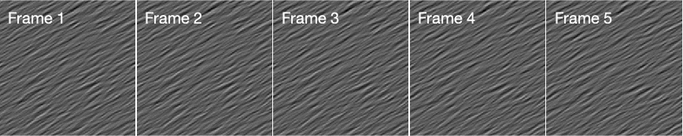

# motion-clouds

A Matlab implementation of Laurent Perrinet's (INT - CNRS) motion cloud spatio-temporal random textures.

Motion clouds are a class of random phase textures. Here they are implemented as dense mixtures of localized drifting gratings with random positions.

For a formal description see:

  Sanz Leon et al., [Motion clouds: model-based stimulus synthesis of
  natural-like random textures for the study of motion perception](https://www.physiology.org/doi/pdf/10.1152/jn.00737.2011).
  J. Neurophysiol. 107:3217-3226, 2012.

For Laurent Perrinet's Python implementation see:

  https://github.com/NeuralEnsemble/MotionClouds.git

Example usage:
```
import motionclouds.*

m = motioncloud(256,256,120);     % 256 x 256 texels, 120 frames

% override default parameters
m.th = pi/3;                      % mean orientation (radians)
[m.Vx,m.Vy] = pol2cart(m.th,1.0); % mean horiz. and vert. speed
m.sf = 32/m.Nx;                   % mean spatial frequency (32 cycles per frame)
m.alpha = 1.0;                    % 1/f noise spectral density
m.contrast = 0.12;                % contrast energy
m.method = 'ENERGY';

% generate the spatio-temporal image sequence
s = m.getSequence();

% preview it...
figure; colormap(gray(256));
for ii = 1:m.Nt % loop over frames
  imagesc(s(:,:,ii); axis image
  delay(0.020);
end
```

The example above produces a spatio-temporal texture, the first 5 frames of which look something like:

